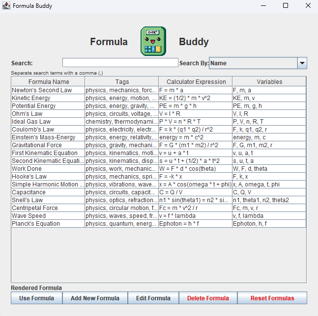
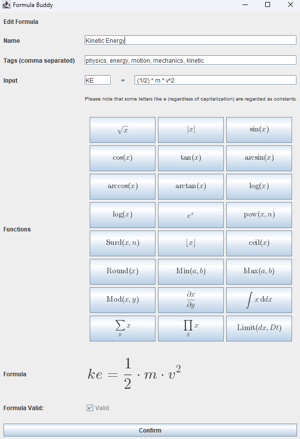
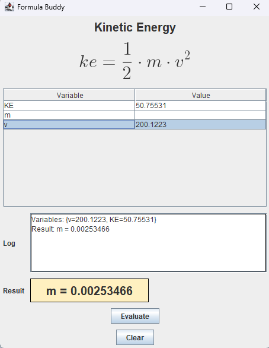

# Formula Buddy

**Formula Buddy** is a niche calculator that focuses on saving and using formulas - kind of like a **dictionary for equations**. 📖

## ✨ Features 
- ➕ Create, edit, save, filter, and use equations by selecting one via a sorted list.
- ✖️ Increases efficiency when utilizing the same formula but with different variable values or solving for a different unknown. 
- ➖ Utilizes Symja's powerful math engine for calculations.
- ➗ Intuitive single-window UI contains all the functionality needed to manipulate and use equations.
- 🟰 Standalone app on windows - does not require a JRE or JDK because it comes bundled with it.
- 🤖 UNTESTED FEATURE: Symja includes the ability for more complex mathematical functions like integration and differentiation. You have the ability to create equations with these functions but they may not compute correctly - if at all.

## 📦 Download
1. 📥 Download the latest version from the [Releases](https://github.com/nmthomson14/FormulaBuddy/releases) page.
2. 📂 Unzip the file. Make sure to keep all files together inside of a single folder.
3. 🖱️ Place the unzipped contents in an easily accessibly folder. Consider creating a folder called "Apps" on your desktop and placing it inside there.
4. ‼️**IMPORTANT**: You should **NOT** place this application in your program files or any other directory that requires admin privileges. This is because It reads and writes from a JSON file that saves directly in the application folder (allowing for easier deletion with no stray files). 
5. ⏩ **OPTIONAL**: Right click on the exe file and select Show More Options > Send To > Desktop to create a shortcut.

## 🛠️ How It Works
You can launch the app via the optionally created shortcut or the .exe or .jar file.
### ⚡Use A Formula
Select a single formula and click the "Use Formula" button. This opens a seperate window with a table of automatically retrieved variables. **PLEASE NOTE:** This app only supports concrete calculations. You must enter in numerical values for all but one unknown.
### 📚 Add A Formula
Simply click the "Add New Formula" button. This opens a seperate window where you can use the alloted buttons to create a formula which will be translated into plain text that Symja can read and evaluate. Valid variables are automatically recognized. There is a "Valid Formula" verification at the bottom - though this unfortunately is not very accurate.
### ✏️ Edit A Formula
Select a single table entry and click "Edit Formula". This will prepopulate the formula input screen and allow you to overwrite the current saved formula. Changes will **NOT** be saved unless you click confirm!
### 🗑️ Delete A Formula
Select a single table entry and click "Delete Formula". There is no recovery for this since it will be purged from the JSON file immediately! 
### ⛔ Resetting To Defaults
This program comes with a few useful scientific equations. You can reset back to these by simply pressing "Reset Formulas". Please note that this is irreversible! You can always create a duplicate of the JSON file by navigating to the folder which contains the .jar and searching for formula_records.ser then duplicating it for backup.

## 📷 Demo Images

### Simple One-Window UI
- Everything you need in a simple and intuitive layout.

### Comprehensive Formula Creation
- Includes buttons to translate mathematical functions into plain text that can be used by the math engine.

### Efficient Formula Calculation
- Simply assign numerical values to all but one variable to quickly calculate results. 

